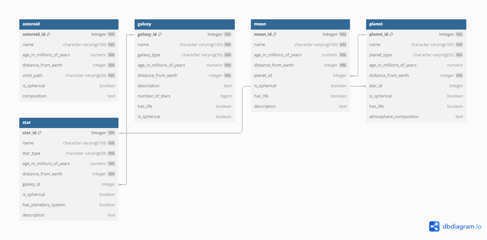

# Celestial Bodies Database

## Description
A PostgreSQL database to store detailed information about celestial bodies including galaxies, stars, planets, moons, and asteroids.

## Table of Contents
 [Prerequisites](#prerequisites)
 [Installation and Setup](#installation-and-setup)
 [Database Schema](#database-schema)
 [License](#license)

## Prerequisites
- PostgreSQL
- Git

## Database Schema

## License
[MIT License](LICENSE)
